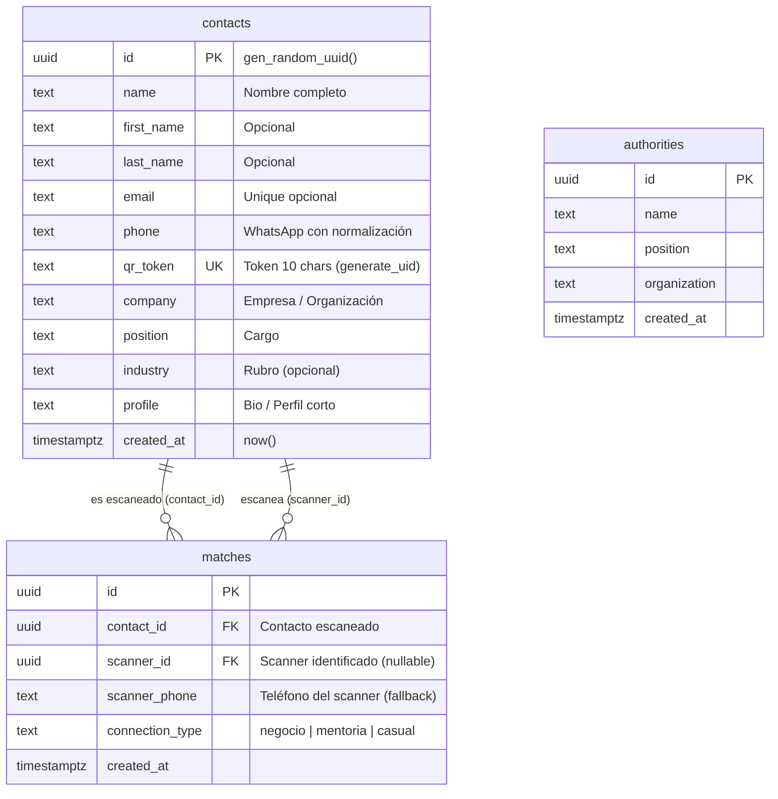

# Connectify - Networking y Gestión de Contactos para Eventos

Connectify es una plataforma web para gestionar el networking en eventos profesionales. Permite cargar bases de datos de asistentes desde Excel, generar credenciales con QR personalizados, imprimirlos en impresoras térmicas, y rastrear las conexiones generadas a través de WhatsApp Business API con clasificación automática del tipo de conexión.

## Funcionalidades Principales

- **Carga Masiva de Contactos**: Procesamiento de archivos `.xlsx` y `.csv` con mapeo inteligente de columnas (Nombre, Email, Teléfono, RUT, Empresa, Cargo). Modo dual con ExcelJS para `.xlsx` y fallback a parser CSV.
- **Registro Manual**: Formulario web para crear contactos individuales desde el panel de administración.
- **Credenciales con QR**: Generación de credenciales renderizadas en Canvas (nombre con word-wrap, empresa, línea divisoria y QR opcional) en formato 62mm x 62mm para etiquetas Brother QL-800.
- **Impresión Térmica Directa**: Integración con **QZ Tray** mediante WebSocket con autenticación RSA SHA-512 (challenge-response). Detección automática de impresora Brother QL-800. [Ver guía de configuración en Windows](./DOCS_QZ_WINDOWS.md).
- **Integración WhatsApp Business API**: Webhook que recibe mensajes entrantes, extrae tokens QR del formato `@XXXXXXXX`, crea registros de match, y envía mensajes interactivos con botones para clasificar la conexión (Negocio / Mentoría / Casual). Incluye envío de tarjeta de contacto (vCard).
- **Dashboard de Matches**: Analítica en tiempo real con volumen total de conexiones, tasa de identificación, distribución por tipo de conexión (porcentajes con conteo al hacer hover), top 10 perfiles más conectados, e historial de actividad por usuario.
- **Gestión de Autoridades**: Tabla separada para VIPs, speakers y organizadores con carga masiva desde Excel y credenciales diferenciadas.
- **Sistema de Identidad**: Reconocimiento basado en `localStorage` (`connectify_user_id`) complementado con verificación por número de WhatsApp. Sin necesidad de login tradicional.

---

## Stack Tecnológico

### Core

| Tecnología | Versión | Uso |
|------------|---------|-----|
| Next.js (App Router) | 16 | Framework fullstack con Server Actions |
| React | 19 | UI |
| TypeScript | 5 | Tipado estático |
| Tailwind CSS | 4 | Estilos |

### Librerías

| Librería | Uso |
|----------|-----|
| [@supabase/supabase-js](https://supabase.com/) | Cliente PostgreSQL (base de datos) |
| [exceljs](https://github.com/exceljs/exceljs) | Lectura y procesamiento de archivos Excel |
| [qrcode](https://github.com/soldair/node-qrcode) | Generación de códigos QR |
| [qz-tray](https://qz.io/) | Comunicación WebSocket con impresoras térmicas |
| [jspdf](https://github.com/parallax/jsPDF) | Generación de PDF como fallback de impresión |
| [framer-motion](https://www.framer.com/motion/) | Animaciones |
| [lucide-react](https://lucide.dev/) | Iconos |
| [vitest](https://vitest.dev/) | Testing unitario e integración |

---

## Estructura del Proyecto

```
connectify/
├── app/
│   ├── page.tsx                        # Portal de check-in (buscar e imprimir credenciales)
│   ├── layout.tsx                      # Layout raíz
│   ├── globals.css
│   ├── api/
│   │   ├── qz-sign/route.ts           # Firma RSA para QZ Tray
│   │   └── whatsapp/webhook/route.ts   # Webhook WhatsApp Business API
│   ├── admin/
│   │   ├── page.tsx                    # Dashboard admin (carga Excel)
│   │   ├── contactos/[id]/page.tsx     # Página de credencial individual
│   │   ├── autoridades/page.tsx        # Gestión de autoridades/VIPs
│   │   └── registro-manual/page.tsx    # Registro manual de contactos
│   ├── connect/[id]/page.tsx           # Landing del escaneo QR (redirige a WhatsApp)
│   ├── matches/page.tsx                # Dashboard analítico de conexiones
│   ├── components/
│   │   ├── FileUpload.tsx              # Carga de archivos Excel
│   │   ├── ContactTable.tsx            # Tabla paginada de contactos con búsqueda
│   │   ├── AuthorityTable.tsx          # Tabla de autoridades
│   │   ├── AuthorityFileUpload.tsx     # Carga de archivos Excel para autoridades
│   │   ├── IdentityStatus.tsx          # Badge de identidad del usuario
│   │   ├── AdminNavbar.tsx             # Navegación admin compartida
│   │   └── ui/Input.tsx                # Componente input reutilizable
│   └── actions/
│       ├── contacts.ts                 # Server actions para contactos
│       └── authorities.ts              # Server actions para autoridades
├── lib/
│   ├── supabase.ts                     # Cliente Supabase
│   ├── qz.ts                          # Integración QZ Tray
│   ├── credentialRenderer.ts           # Renderizado de credenciales en Canvas
│   ├── authorityCredentialRenderer.ts  # Credenciales de autoridades
│   └── services/
│       ├── contactService.ts           # Queries de contactos
│       ├── whatsappService.ts          # Integración WhatsApp API
│       └── authorityService.ts         # Queries de autoridades
├── certificates/                       # Certificados locales QZ Tray
└── public/
    └── digital-certificate.txt         # Certificado público QZ Tray
```

---

## Arquitectura de Datos (Supabase / PostgreSQL)

La persistencia de datos utiliza PostgreSQL sobre Supabase, con un esquema diseñado para alta disponibilidad de lectura y trazabilidad de conexiones sin autenticación tradicional.

### Modelo de Entidad-Relación



### Seguridad y Acceso (RLS)

El proyecto implementa **Row Level Security (RLS)** para permitir operaciones desde el cliente manteniendo la integridad:

- **`contacts`**: Lectura pública (`SELECT`) para búsquedas en check-in y visualización de perfiles. Inserción permitida para registros manuales.
- **`matches`**: Inserción pública. Actualización (`UPDATE`) permitida para clasificar la conexión desde el webhook de WhatsApp.
- **`authorities`**: Acceso total simplificado para gestión administrativa.

### Lógica de Base de Datos y Funciones SQL

Se utilizan funciones personalizadas en PL/pgSQL para automatizar procesos críticos:

| Función | Propósito |
|---------|-----------|
| `generate_uid(length)` | Genera tokens alfanuméricos únicos para los códigos QR, minimizando colisiones. |
| `remove_duplicate_contacts()` | Limpieza inteligente basada en coincidencia de Nombre + Email/Teléfono. |
| `purge_contacts()` | Reseteo controlado de la base de datos para nuevos eventos. |

### Identificación de Usuario "Sin Login"

La arquitectura soporta un flujo de identidad híbrido:
1. **Identidad Persistente**: Al escanear por primera vez, se asocia el `scanner_phone` (desde WhatsApp) con un registro en `contacts`.
2. **Fallback por Token**: Si el usuario no está en la base, se utiliza su número de teléfono como identificador único en la tabla `matches` hasta que complete su perfil.
3. **Constraint de Unicidad**: El campo `qr_token` garantiza que cada credencial impresa sea única y rastreable permanentemente.

---

## Rutas y API

| Ruta | Descripción |
|------|-------------|
| `/` | Portal de check-in (búsqueda e impresión de credenciales) |
| `/connect/[id]` | Landing de escaneo QR (registra match y redirige a WhatsApp) |
| `/admin` | Dashboard de administración con carga de Excel |
| `/admin/contactos/[id]` | Credencial individual de un contacto |
| `/admin/registro-manual` | Formulario de registro manual |
| `/admin/autoridades` | Gestión de autoridades y VIPs |
| `/matches` | Dashboard analítico de conexiones |
| `POST /api/qz-sign` | Firma server-side del challenge RSA para QZ Tray |
| `GET/POST /api/whatsapp/webhook` | Webhook de WhatsApp (verificación y recepción de mensajes) |

---

## Flujo de Trabajo

### Escaneo y Registro de Match

1. El usuario escanea un QR físico que contiene un enlace a `/connect/[qr_token]`.
2. La app verifica si el navegador tiene un `connectify_user_id` en localStorage.
3. Se registra un match en la base de datos:
   - Con ID almacenado: el match se asocia al contacto identificado.
   - Sin ID: el match se registra como anónimo.
4. Se redirige al usuario a WhatsApp con un mensaje personalizado.

### Clasificación de Conexión vía WhatsApp

1. El webhook recibe el mensaje entrante con el token QR (formato `@XXXXXXXX`).
2. Se crea el registro de match vinculando scanner con el contacto del QR.
3. Se envía un mensaje interactivo con botones: **Negocio** / **Mentoría** / **Casual**.
4. Al seleccionar una opción, se actualiza el `connection_type` del match.
5. Se envía la tarjeta de contacto (vCard) del dueño del QR.

### Modos de Salida para Credenciales

- `NEXT_PUBLIC_QR_OUTPUT_MODE=PRINT`: Imprime via QZ Tray; si falla, ofrece PDF.
- `NEXT_PUBLIC_QR_OUTPUT_MODE=PDF`: Descarga directamente el PDF.

---

## Testing

Tests unitarios y de integración con **Vitest**. Los test files están co-ubicados junto a su código fuente.

```bash
npm test          # Ejecutar todos los tests
npm run test:watch # Modo watch
```

**Cobertura de tests:**

| Archivo | Tests | Tipo |
|---------|-------|------|
| `lib/services/whatsappService.test.ts` | 8 | Normalización de teléfonos chilenos |
| `lib/services/contactService.test.ts` | 10 | Búsqueda por identificador (mock Supabase) |
| `lib/services/whatsappService.integration.test.ts` | 6 | Envío de contact card (mock fetch) |
| `app/api/whatsapp/webhook/route.test.ts` | 17 | Webhook GET/POST handlers |
| `app/actions/contacts.test.ts` | 30 | Parsing CSV/Excel, mapeo de columnas |
| `lib/credentialRenderer.test.ts` | 7 | Word-wrap de texto en canvas |

---

## Configuración Local

1. Clonar el repositorio.
2. Instalar dependencias:
   ```bash
   npm install
   ```
3. Configurar las variables de entorno en `.env`:
   ```env
   # Supabase
   NEXT_PUBLIC_SUPABASE_URL=
   NEXT_PUBLIC_SUPABASE_PUBLISHABLE_DEFAULT_KEY=
   SUPABASE_SERVICE_ROLE_KEY= # Requerido para scripts de mantenimiento

   # QR / Impresión
   NEXT_PUBLIC_QR_OUTPUT_MODE=PRINT
   NEXT_PUBLIC_PRINTER_NAME=Brother QL-800

   # WhatsApp Business API
   WHATSAPP_ACCESS_TOKEN=
   WHATSAPP_PHONE_ID=
   WHATSAPP_VERIFY_TOKEN=
   NEXT_PUBLIC_WHATSAPP_NUM_BUSINESS=

   # QZ Tray (clave privada RSA para firma de challenges)
   QZ_PRIVATE_KEY=
   ```
4. Iniciar el servidor de desarrollo:
   ```bash
   npm run dev
   ```

---

## Scripts de Mantenimiento

Existen scripts en la carpeta `scripts/` para tareas administrativas. Para ejecutarlos se recomienda usar `tsx`:

```bash
# Limpiar contactos duplicados (usa el procedimiento almacenado remove_duplicate_contacts)
npx tsx scripts/clean-duplicates.ts

# Test de envío de mensajes por WhatsApp
npx tsx scripts/test-whatsapp.ts
```

---

## Roadmap (Próximos Pasos)

### 🚀 User Experience
- **VCard Directa**: Opción para descargar el contacto en formato `.vcf` directamente desde la landing.
- **Seguimiento Automático**: Envío de mensaje de seguimiento (follow-up) 24h después de la conexión.
- **PWA**: Optimización para uso como aplicación móvil nativa para organizadores.

### 🎖️ Business Intelligence (ROI)
- **Sponsor Engagement Score**: Analítica de qué stands capturaron más leads únicos.
- **Networking Velocity**: Indicador en tiempo real de conexiones por minuto.
- **Company Power Ranking**: Ranking de empresas con empleados más activos conectando.

---

## Guías de Desarrollo

Para mantener la consistencia en el código y seguir los patrones del proyecto, consulta [AGENTS.md](./AGENTS.md). Este archivo contiene las normas para:
- Estilo de commits.
- Uso de componentes de UI (Tailwind 4 + Framer Motion).
- Patrones de Server Actions y Supabase.

---

## Despliegue

La aplicación está configurada para desplegarse en **Vercel** con soporte nativo de Next.js. Las páginas de admin y matches usan `force-dynamic` para asegurar datos siempre actualizados.
